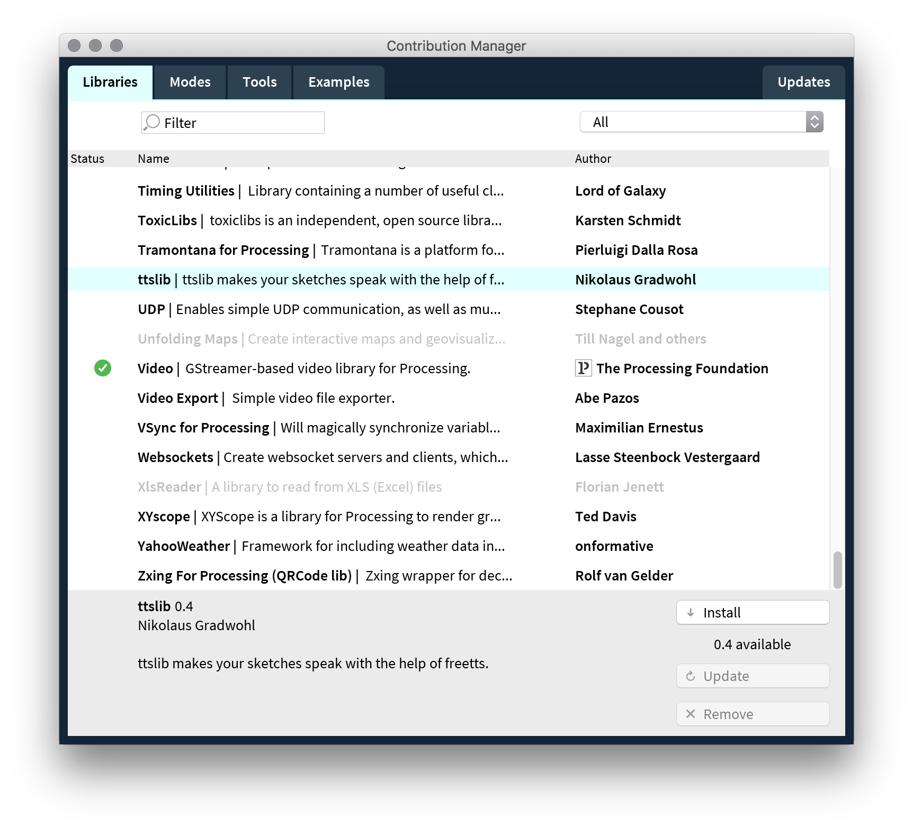
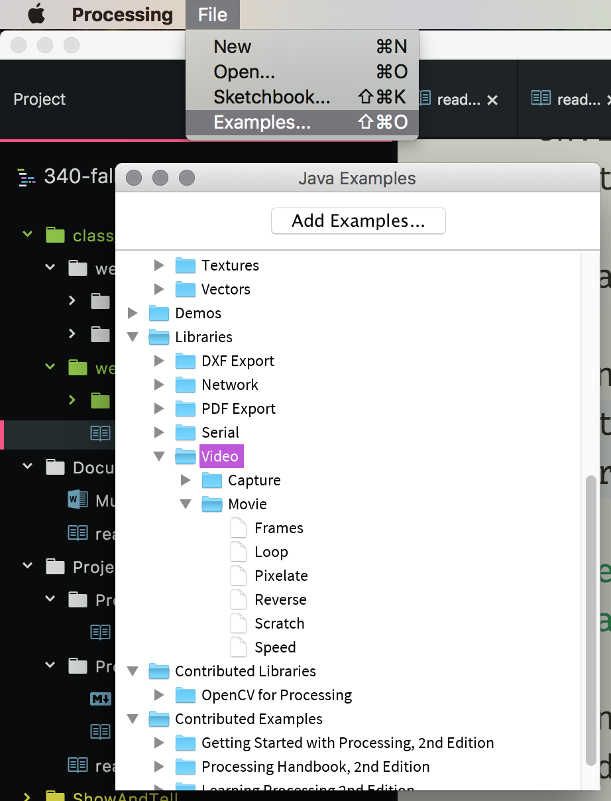

# Working with Processing towards OpenCV

Processing allows for many additional libraries to be integrated into its workflow.

## Video Lib

One library you may find useful for Processing allows you to easily work with Videos. This includes web cam video and file-based video. To do this, you will need to add the Video Library to your Processing environment, as well as into you sketch.

To add a library in Processing, you need to open the "Contribution Manager". To easily do this, go to "Sketch" → "Import Library" → "Add Library..."

Then, you can scroll down, find "Video", and click install.

 

Finally, to learn about using the library, you should open the "Examples" window, navigate to "Libraries" → "Video"

 
 

For more on using the Video Library, please read;

- [Video \ Processing.org](https://processing.org/tutorials/video/)

## openCV

_openCV_ stands for [Open Source Computer Vision Library](http://opencv.org/about.html). openCV in Processing is a library, that wraps the functionality of the base openCV library into Processing.

As mentioned from the site...

> OpenCV was built to provide a common infrastructure for computer vision applications and to accelerate the use of machine perception in the commercial products

#### Install

To install the openCV library, please follow the same info as above for Video. Instead, look for openCV.

#### openCV Reference

- [openCV Reference](https://ubaa.net/shared/processing/opencv/index.html)

- [openCV GitHub](https://github.com/atduskgreg/opencv-processing)
